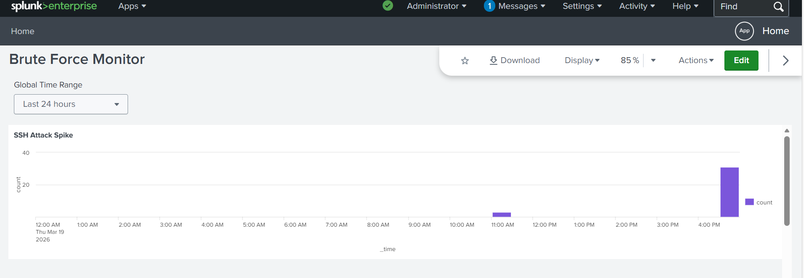

# Splunk-SSH-BruteForce-Lab
A SIEM project simulating and detecting SSH brute-force attacks using WSL Ubuntu and Splunk Enterprise.
## Project Overview
This project demonstrates how to set up a Security Information and Event Management (SIEM) pipeline to detect brute-force attacks. I simulated an attack on a Linux environment (WSL Ubuntu) and used Splunk Enterprise on Windows to analyze the logs and visualize the threat.

## Tools Used
* **Operating System:** Windows 11 with WSL2 (Ubuntu 22.04)
* **SIEM:** Splunk Enterprise
* **Scripting:** Bash (for attack simulation)
* **Log Source:** `/var/log/auth.log`

## Deployment & Methodology
1. **Log Redirection:** Due to permission constraints between WSL and Windows, I automated the copying of Linux `auth.log` to a Windows-accessible directory.
2. **Splunk Configuration:** Set up a "File Monitor" input in Splunk to ingest the mirrored log file.
3. **Attack Simulation:** Executed a Bash loop to generate 50+ "Failed password" events for a non-existent user.
4. **Data Analysis:** Developed SPL queries to identify spikes in authentication failures.

## Visualizations
### Attack Spike Detected


## Key SPL Queries Used
```splunk
# To find failed logins by user and IP
index=* "Failed password" | stats count by user, src_ip

# To visualize the attack over time
index=* "Failed password" | timechart span=1m count
